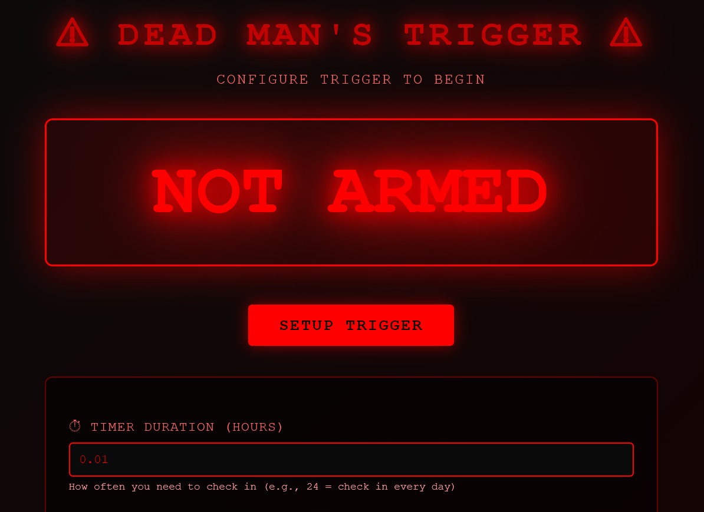
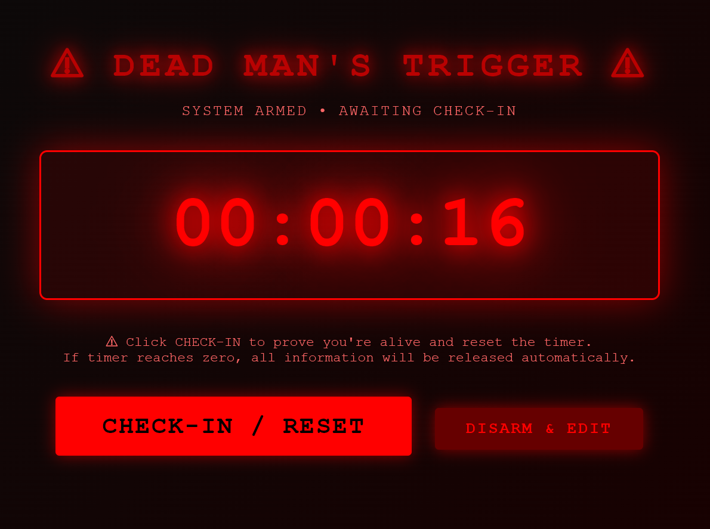

# ⚠️ Dead Man's Trigger

**A server-powered dead man's switch that automatically sends emails when you fail to check in.**

Unlike browser-only solutions, this actually works when you're incapacitated because the timer runs on a server with automatic email delivery.

---

## 🚨 IMPORTANT: Read Before Contributing

**ALL commits must be authored by ringmast4r only.**

See `COMMIT-RULES.md` for commit guidelines. Never include AI attribution or co-authorship tags in commits to this repository.

---

## 📸 Screenshots

**Main Interface - Setup Screen**



**Armed & Counting Down**



---

## ✨ Features

- ✅ **Server-side countdown** - Runs 24/7, even when your browser is closed
- ✅ **Automatic email sending** - No manual clicks required
- ✅ **File attachments** - Automatically emails files when triggered
- ✅ **Persistent storage** - SQLite database survives server restarts
- ✅ **Simple web interface** - Easy setup and check-in from any browser
- ✅ **Privacy-focused** - Success page hides sensitive data
- ✅ **SendGrid powered** - Reliable email delivery via Web API

---

## 🚀 Quick Start

### Prerequisites

- Node.js v14+ ([Download](https://nodejs.org/))
- SendGrid account (free tier: 100 emails/day)

### Installation

```bash
# 1. Clone or download this repo
git clone https://github.com/Ringmast4r/DEAD-MANS-TRIGGER.git
cd DEAD-MANS-TRIGGER

# 2. Install dependencies
npm install

# 3. Configure email
cp .env.example .env
# Edit .env with your SendGrid API key

# 4. Start server
npm start

# 5. Open web interface
# Visit http://localhost:3000
```

---

## 📧 Email Configuration

The server uses SendGrid Web API for reliable email delivery.

### Step 1: Sign Up for SendGrid

1. Go to [SendGrid Signup](https://signup.sendgrid.com/)
2. Free tier: 100 emails/day forever (no credit card)
3. Verify your email address

### Step 2: Create API Key

1. Go to [API Keys](https://app.sendgrid.com/settings/api_keys)
2. Click "Create API Key"
3. Name: "Dead Mans Trigger"
4. Permission: Full Access
5. Copy the API key

### Step 3: Authenticate Your Domain (CRITICAL)

**Why?** Without domain authentication, Gmail/Outlook may silently drop your emails.

1. Go to [Sender Authentication](https://app.sendgrid.com/settings/sender_auth)
2. Click "Authenticate Your Domain"
3. Enter your domain (e.g., `yourdomain.com`)
4. Add the DNS records to your domain provider (Cloudflare, GoDaddy, etc.)
5. Click "Verify" in SendGrid

### Step 4: Configure .env File

```env
SENDGRID_API_KEY=SG.your-api-key-here
SENDER_EMAIL=alerts@yourdomain.com
SENDER_NAME=Dead Mans Trigger
REPLY_TO_EMAIL=your-personal-email@example.com
```

**Important:**
- `SENDER_EMAIL` must use your authenticated domain
- `REPLY_TO_EMAIL` is where recipients' replies go (can be any email)

---

## 📖 How to Use

### 1. Setup Trigger

- Open http://localhost:3000
- Click "SETUP TRIGGER"
- Set timer duration (e.g., 24 hours = check in daily)
- Add email recipients (comma-separated)
- Write your secret message
- Optional: Upload file, add URLs
- Click "ARM TRIGGER"

### 2. Check In Regularly

- Click "CHECK-IN / RESET" before timer expires
- Proves you're alive and resets countdown
- Can close browser - server keeps running!

### 3. What Happens When Triggered

- Server automatically sends emails to all recipients
- Includes your secret message
- Attaches any uploaded files
- Privacy-focused success page shows delivery stats (not sensitive data)

---

## 🧪 Testing

Test with a 1-minute trigger:

```
Duration: 0.0167 hours (1 minute)
Recipients: your-email@example.com
Message: "This is a test"
```

Wait 1 minute → Check your email inbox!

---

## 🛠️ Technical Details

- **Backend:** Node.js + Express
- **Database:** SQLite
- **Email:** SendGrid Web API (@sendgrid/mail)
- **Scheduler:** node-cron (checks every 10 seconds)
- **Frontend:** Vanilla HTML/CSS/JavaScript

No frameworks, no build step - just simple reliable tech.

---

## 📁 Project Structure

```
DEAD-MANS-TRIGGER/
├── server.js             # Main server
├── index.html            # Web interface
├── package.json          # Dependencies
├── .env.example          # Email config template
├── COMMIT-RULES.md       # Git commit policy
├── .gitignore            # Protects sensitive files
└── deadman.db            # Database (auto-created)
```

---

## 🚀 Deployment

For 24/7 operation, deploy to cloud:

**Recommended Platforms:**
- **Render** - Free tier, easy setup
- **Railway** - Simple deployment
- **Heroku** - Free tier available
- **DigitalOcean** - VPS option

**Important:** Most cloud hosts block SMTP ports. This is why we use SendGrid Web API (HTTPS port 443) instead of SMTP.

### Quick Deploy to Render

1. Push code to GitHub
2. Sign up at [Render.com](https://render.com/)
3. New Web Service → Connect your repo
4. Add environment variable: `SENDGRID_API_KEY`
5. Deploy!

---

## ⚠️ Important Notes

### What This IS:

- ✅ A functional dead man's switch for personal use
- ✅ Great for education and understanding automation
- ✅ Reliable for non-critical scenarios

### What This ISN'T:

- ❌ Enterprise-grade security
- ❌ Encrypted data storage
- ❌ For life-critical situations

**For critical use cases:** Use professional services like Google Inactive Account Manager or legal document services.

---

## 🔒 Security & Privacy

**Data Protection:**
- Email credentials stored in `.env` (gitignored)
- Database stored locally (unencrypted)
- Files stored as base64 (keep under 10MB)
- Anyone with server access can view data

**Privacy Features:**
- Success page shows recipient COUNT, not addresses
- Message LENGTH shown, not actual content
- File TYPE/SIZE shown, not file contents

**Recommendations:**
- Keep `.env` file private
- Don't commit `.env` to version control
- Use strong passwords for server access
- Consider encryption for sensitive data

---

## 🎯 Use Cases

- Send important info to loved ones if you can't check in
- Educational project for learning timers and automation
- Backup system for critical information
- Reminder system with consequences

---

## 📝 License

MIT License - Use however you want!

---

## 🤝 Contributing

Pull requests welcome!

**Before contributing, read `COMMIT-RULES.md` for commit guidelines.**

Ideas for improvements:
- End-to-end encryption
- SMS notifications (Twilio)
- Web dashboard for multiple triggers
- Multi-user support
- Advanced scheduling

---

## 📚 Documentation

- **[.env.example](.env.example)** - SendGrid configuration guide
- **[COMMIT-RULES.md](COMMIT-RULES.md)** - Git commit policy

---

## 🐛 Troubleshooting

**Emails not arriving?**
1. Check SendGrid API key is correct
2. Verify domain authentication is complete
3. Check SendGrid Activity Feed for delivery status
4. Make sure `SENDER_EMAIL` uses authenticated domain

**Server won't start?**
1. Run `npm install` to install dependencies
2. Check `.env` file exists and has `SENDGRID_API_KEY`
3. Make sure port 3000 is available

**Database errors?**
1. Delete `deadman.db` file
2. Restart server (will recreate database)

---

**Built by ringmast4r**

**Version:** 2.0 (Server-Powered Edition)

---

## ⚡ Quick Links

- [GitHub Repository](https://github.com/Ringmast4r/DEAD-MANS-TRIGGER)
- [Report Issues](https://github.com/Ringmast4r/DEAD-MANS-TRIGGER/issues)
- [SendGrid Signup](https://signup.sendgrid.com/)
- [Domain Authentication Guide](https://app.sendgrid.com/settings/sender_auth)
